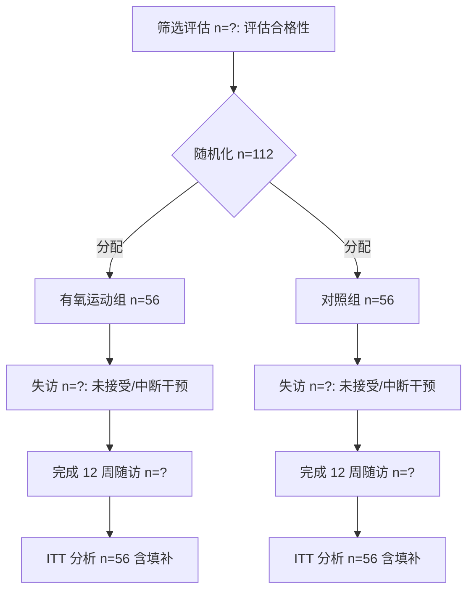

# 研究方案：12 周有氧运动干预对脑卒中患者步行功能的影响——随机对照试验

**版本**：1.0（s01 方案设计）| **日期**：2026-08-14 | **状态**：已确认，待伦理与注册

---

## 1. 研究概述

| 条目 | 内容 |
|---|---|
| 研究设计 | 前瞻性、平行双臂、1:1 随机、评估者盲法、优效性 RCT |
| 研究对象 | 脑卒中后 1–6 个月（亚急性期）或 ≥6 个月（慢性期）成人患者 |
| 干预 | 12 周有氧运动训练（跑步机/功率自行车/地面步行） |
| 对照 | 常规康复 + 健康教育（等时长的非有氧活动指导） |
| 主要终点 | 12 周时 6 分钟步行距离（6MWT）的组间变化差 |
| 次要终点 | 10 m 步行速度、习惯步速、功能性步行分类（FAC） |
| 样本量 | 每组 56 例，共 112 例（含 15% 失访） |
| 随访 | 基线、第 6 周（过程监测）、第 12 周（终点） |

## 2. 研究问题（PICO）

- **P**：成年脑卒中患者（缺血性或出血性，发病 ≥1 个月，可独立或在辅助下行走，FAC ≥ 3）
- **I**：12 周有氧运动训练（频率 3 次/周、每次有效运动 20–40 min、强度从 40% 心率储备渐进至 60–80% 心率储备或 RPE 11–15，形式含跑步机/功率自行车/地面步行，辅以 5–10 min 热身与整理）
- **C**：常规康复 + 健康教育（对照组接受与干预组等接触时长的非有氧活动，如柔韧性训练与健康讲座）
- **O**：主要——12 周 6MWT 变化（米）；次要——10 m 步行速度（m/s）、习惯步速、FAC 分级变化；安全性——不良事件、依从性

**研究假设**（H1）：12 周有氧运动组 6MWT 改善优于对照组，组间均差 ≥ 35 m（临床最小重要差异 MCID 参考 30–35 m，依据慢性期卒中步行训练荟萃）。

## 3. 背景与证据基础（按证据等级标注）

| 证据 | 等级 | 要点 |
|---|---|---|
| Moncion 2024, *Br J Sports Med*（PMID 38413134） | 系统综述 + 贝叶斯网络荟萃（最高） | 有氧运动可改善脑卒中后心血管健康与活动能力；支持将结构化有氧训练纳入卒中康复 |
| Mehta 2012, *Top Stroke Rehabil*（PMID 23192710） | 荟萃分析 | 慢性期心血管适应训练改善舒适步速与步行总距离，效应中等 |
| Peurala 2014, *J Rehabil Med*（PMID 24733289） | 系统综述/荟萃 | 步行训练改善步行功能与自理能力 |
| Macko 2005, *Stroke*（PMID 16151035） | RCT | 慢性期跑步机有氧训练改善步态功能与心肺适能 |
| Globas 2012, *NNR*（PMID 21885867） | RCT | 高强度跑步机训练 3 个月显著改善 6MWT 与步速 |
| Outermans 2015, *Phys Ther*（PMID 25573761） | 系统综述 | 有氧能力与步行速度/距离中度相关，支持有氧训练靶向步行功能 |

**设计依据**：既往 RCT 与荟萃提示 12 周左右有氧训练可使 6MWT 组间差达 35–50 m；本方案取保守估计 35 m 计算样本量，兼顾可行性。

## 4. 纳排标准

**纳入**：
1. 年龄 18–80 岁；2. 首次或复发性缺血性/出血性脑卒中，发病 ≥1 个月；3. 能理解指令并配合评估（MoCA ≥ 21 或 MMSE ≥ 24）；4. 可独立或在单点辅助下行走（FAC ≥ 3）；5. 静息坐位血压 ≤ 180/105 mmHg，无运动禁忌；6. 签署知情同意。

**排除**：
1. 不稳定心绞痛、未控制心律失常、近期（3 个月内）心肌梗死；2. 严重失语/认知障碍无法配合；3. 严重骨关节疾病限制运动；4. 其他进行性神经疾病（帕金森、ALS 等）；5. 同期参加其他干预性试验；6. 妊娠。

## 5. 随机化与盲法

- **随机化**：中心化计算机随机（区组随机，区组大小 4/6 随机混合，按发病时长分层：亚急性 1–6 个月 / 慢性 >6 个月）。分配隐藏采用顺序编号、密封不透光信封（或中心随机系统在线分配）。
- **盲法**：结局评估者盲法（不知分组）；统计分析师盲法（分组变量编码 A/B）。因运动干预性质，受试者与治疗师无法盲法——作为已知局限在讨论中说明。主要终点 6MWT 为客观指标，降低偏倚风险。

## 6. 干预方案（12 周）

**有氧运动组**：
- 频率：3 次/周，共 36 次；单次：热身 5–10 min + 有氧段 + 整理 5–10 min，总时长约 45–60 min。
- 有氧段强度与时长渐进：
  - 第 1–4 周：40–50% 心率储备（HRR），持续 20 min；
  - 第 5–8 周：50–60% HRR，持续 30 min；
  - 第 9–12 周：60–70% HRR（耐受者至 80%），持续 30–40 min；
  - 强度同时以 RPE 11–15（Borg 6–20）与说话测试校准；心率目标 = 静息心率 + 40–70% ×（最大心率 − 静息心率）。
- 形式：跑步机/功率自行车/地面快走（根据患者偏好与设备选择，保持连续有氧模式）；每次记录训练时长、心率、RPE。
- 安全性：每次训练前后测血压心率；暂停标准（胸痛、头晕、收缩压 >200 或 <90 mmHg、血氧 <90% 等）；配备急救流程。

**对照组**：常规康复（按需物理治疗）+ 每周 1 次健康教育讲座（卒中二级预防、生活方式），提供等时长的柔韧性/平衡练习手册（非有氧、非渐进负荷），控制接触时间偏倚。

**依从性管理**：训练日志、电话随访、依从性定义为完成 ≥80% 训练次数；记录退出原因。

## 7. 结局指标

**主要终点**：12 周 6MWT 变化（米；组间 ANCOVA 校正基线后的均差与 95%CI）。
**次要终点**：10 m 步行速度（舒适与最快，m/s）；习惯步速（6MWT 期间）；FAC 分级变化；依从性、不良事件率。
**探索性（标注为探索，不控制多重比较）**：按发病时长（亚急性/慢性）与基线严重程度（FAC 3 vs 4–5）的亚组交互。

测量工具均采用标准化操作手册（6MWT 按 ATS 指南；10 m 步行测试三次取最佳/均值；FAC 由评估者评定）。

## 8. 样本量计算（可复现）

公式（两样本均数比较）：n/组 = 2 × (Z₁₋α/₂ + Z₁₋β)² × σ² / δ²

- 参数：δ = 35 m（组间 6MWT 变化均差，保守取既往 RCT/荟萃下限），σ = 60 m（既往 RCT 6MWT 变化 SD），α = 0.05（双侧），β = 0.20（功效 80%）。
- 结果：每组 47 例；含 15% 失访 → 每组 56 例，**共 112 例**。
- 敏感性分析：δ=30/σ=60 → 每组 75 例；δ=40/σ=60 → 每组 43 例；δ=35/σ=65 → 每组 65 例。方案取值介于敏感性区间，结果稳健。
- 复现：`scripts/sample_size.py`（`python scripts/sample_size.py`）。

## 9. 统计分析计划（SAP 概要，s03 细化）

1. **ITT 原则**：按随机分组分析全部随机化受试者；缺失结局用多重填补（MICE，50 次，含基线与依从性变量）后分析，并报告填补前后一致。
2. **基线表**：按分组描述人口学与临床特征；连续变量用均数±SD/中位数(IQR)，分类变量用 n(%)；不做组间正式假设检验（依 CONSORT 建议），用标准化均差评估均衡性。
3. **主要分析**：6MWT 变化值（12 周 − 基线）为因变量，ANCOVA 校正基线 6MWT 与分层变量（发病时长），报告组间校正均差、95%CI、p 值。
4. **次要终点**：同样 ANCOVA；FAC 用有序回归或卡方检验（探索性）。
5. **敏感性分析**：PP 分析（依从性 ≥80% 且完成终点）；完整病例分析；不同填补参数。
6. **亚组探索**：发病时长、基线 FAC 分层交互项，结果仅作探索，不用于主要结论。
7. **效应量**：报告组间均差（95%CI）与标准化均差；不单独依赖 p 值。
8. 显著性水平 α=0.05（双侧）；多重比较仅用于次要/探索指标，结果解释从克制。

## 10. 数据管理与质量保障

- 设计 CRF 与数据字典（s02 执行）：基线（人口学、NIHSS、发病时长、合并症、用药）、每次训练日志、终点测量、不良事件、依从性。
- 双人独立录入 + 一致性核对（差异回查原始 CRF）；逻辑校验规则；数据锁定前审计。
- 不良事件分级（CTCAE）与严重不良事件 24 h 内上报；设数据安全监查（DSMB 咨询）。

## 11. 伦理与注册

- 伦理委员会审批（人类受试者研究）；所有受试者书面知情同意。
- 前瞻性注册于 ClinicalTrials.gov（或中国临床试验注册中心 ChiCTR）后再入组。
- 遵循《赫尔辛基宣言》与 CONSORT 2010 报告规范（Schulz 2010, BMJ）。

## 12. 时间线与里程碑

| 阶段 | 周期 |
|---|---|
| 伦理与注册 | 第 0–2 月 |
| 入组与随机化 | 第 3–9 月（目标 112 例，约 16 例/月） |
| 干预与随访 | 每受试者 12 周 |
| 数据锁定与统计分析 | 末例完成 +2 月 |
| 报告撰写 | +2 月（s04） |

## 13. CONSORT 流程图框架（s02 采集后填充实际数字）

## 14. 局限与质量门槛

**局限**：① 运动干预无法对受试者/治疗师设盲（评估者盲法缓解）；② 效应量来自国外人群，需在本地人群验证；③ 单一中心可能限制外推；④ MCID 30–35 m 为慢性期文献参考值。

**质量门槛（s01 验收）**：PICO 明确 ✓；主要/次要终点可测量 ✓；样本量有文献依据且可复现 ✓；干预可操作（FITT 原则量化）✓；统计计划预设 ✓。

---

## 附录 A：可复现检索策略（PubMed，2026-08-14 执行）

1. `aerobic training stroke gait speed walking distance meta-analysis` → 命中 Mehta 2012（PMID 23192710）、Moncion 2024（38413134）、Peurala 2014（24733289）等
2. `Macko treadmill aerobic exercise chronic stroke randomized 6-minute walk` → 命中 Macko 2005（16151035）、Globas 2012（21885867）
3. 补充：`aerobic capacity walking speed distance stroke systematic review` → Outermans 2015（25573761）

## 附录 B：参考文献（Vancouver 格式）

1. Moncion K, Rodrigues L, Wiley E, et al. Aerobic exercise interventions for promoting cardiovascular health and mobility after stroke: a systematic review with Bayesian network meta-analysis. Br J Sports Med. 2024;58(6):334-344. PMID: 38413134.
2. Mehta S, Pereira S, Janzen S, et al. Cardiovascular conditioning for comfortable gait speed and total distance walked during the chronic stage of stroke: a meta-analysis. Top Stroke Rehabil. 2012;19(6):463-470. PMID: 23192710.
3. Peurala SH, Karttunen AH, Sjögren T, et al. Evidence for the effectiveness of walking training on walking and self-care after stroke: a systematic review and meta-analysis of randomized controlled trials. J Rehabil Med. 2014;46(5):387-399. PMID: 24733289.
4. Macko RF, Ivey FM, Forrester LW, et al. Treadmill exercise rehabilitation improves ambulatory function and cardiovascular fitness in patients with chronic stroke: a randomized, controlled trial. Stroke. 2005;36(10):2206-2211. PMID: 16151035.
5. Globas C, Becker C, Cerny J, et al. Chronic stroke survivors benefit from high-intensity aerobic treadmill exercise: a randomized control trial. Neurorehabil Neural Repair. 2012;26(1):85-95. PMID: 21885867.
6. Outermans J, van de Port I, Wittink H, et al. How strongly is aerobic capacity correlated with walking speed and distance after stroke? Systematic review and meta-analysis. Phys Ther. 2015;95(6):835-853. PMID: 25573761.
7. Schulz KF, Altman DG, Moher D; CONSORT Group. CONSORT 2010 statement: updated guidelines for reporting parallel group randomised trials. BMJ. 2010;340:c332.

*注：附录 B 中卷期页码为人工补全，投稿前以数据库核实为准。*
