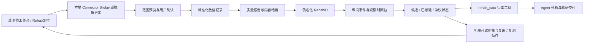

# Galen 真实世界康复数据闭环

## 产品定义

Galen 的核心不是通用 Agent，而是把真实康复数据从本地业务系统安全地转化为可追溯、可复现、可持续更新的科研证据。Agent 是闭环的操作层，不是数据事实源。

## 当前已经跑通的链路

当前实现具备：

- 两个本地数据源：康复师工作台与 RehabGPT。
- Bridge 优先、下载目录备份文件兜底的数据发现。
- 用户确认后才写入研究工作区。
- 原始导出不复制进研究数据；标准化文件、质量报告和导入回执保留哈希。
- RehabID、时间点、指标、单位、来源数据集和上游评估记录的追溯链。
- 未经质量或人工确认的 Connector 观察默认标为 `candidate`。
- Agent 默认只读取 `verified` 观察；质量审计必须显式请求候选数据。
- 估算 Cobb 角不会通过 Connector 进入治理后时间轴。
- Galen 审核结果通过 `feedback.json` 回到 RehabMain，显式关联 RehabID、上游评估记录、观察值、决定、更正值以及复采/复测动作。
- RehabMain 将回流记录显示为持续刷新的研究执行队列，形成首条双向连接器回路。

## 本轮修复的信任缺口

1. 上游缺少 `shortCode` 时，旧实现可能用姓名生成 RehabID。现在改为根据不透明上游记录 ID 生成稳定伪名，姓名不进入预览返回或研究时间轴。
2. 旧实现把 Connector 数值统一标记为 `verified`。现在统一进入 `candidate`，并在导入结果中显示待核验数量。
3. 旧实现接收 `cobbAngleEstimate`。现在只保留观察型 ATR / scoliometer 读数，阻止诊断式估算进入研究事实层。
4. 旧 `rehab_data` 只读取独立的 `blood.db`，Agent 无法访问刚导入的 RehabID。现在增加 `list_rehab_cases` 与 `rehab_case` 两个工作区只读操作。

## 数据治理基础设施进展

### 已完成：协议注册表 v1

`rehab-screening-core@1.0.0` 已作为版本化 JSON 进入运行时，明确：

- 规范指标名、单位、方向和身体区域；
- 采集设备、协议版本和操作者角色；
- 质量规则及其证据等级；
- 哪些字段属于观察、推导、模型估计或人工判定；
- 哪些指标允许进入筛查，哪些必须等待专业复核。

注册表在统一时间轴入口执行，而非只依赖单个连接器：别名被映射到规范指标，单位不匹配或未注册指标自动进入候选队列，协议排除字段无法从其他导入入口绕过。

### 已完成：通用观察审核

RehabID 页面已支持接受、拒绝和更正候选观察，并记录：

- 审核人、时间与具体理由；
- 审核前后的值、单位和状态；
- 协议版本与单位重新校验；
- revision 冲突检测，防止并发审核静默覆盖；
- 审核后事件状态和 Cohort 行的增量重算。

审核决定现在会回流 RehabMain。下一步需要把当前本地审核人占位值接入真实用户身份，并让已引用观察的变更主动触发交付物过期标记。

## 尚未闭合的关键环节

### P1：研究动作完成与结果反馈

Galen 已能把接受、排除、更正、复采和复测动作回流 RehabMain；下一步是让 RehabMain 回传动作完成时间、新评估记录和结果，把“决定 → 执行 → 新数据”完整建模为可学习序列。

### P1：数据集构建器

需要从 RehabID 时间轴生成不可变数据集版本，并自动检查：

- 受试者级划分泄漏；
- 标签来源和时间截断；
- 缺失、冲突与排除原因；
- 数据集、代码、参数和结果之间的哈希关系。

## 下一条最短闭环

优先选择青少年姿态与脊柱风险筛查：

1. 从工作台导入一次真实但脱敏的筛查记录。
2. 使用 Protocol Registry 校验采集协议与质量。
3. 人工核验候选观察。
4. 由 Agent 只基于已核验观察生成非诊断性筛查摘要。
5. 记录复采、复核或复测动作及最终结果。
6. 将新结果追加到同一 RehabID，重新生成可追溯报告。

只有这六步在真实记录上连续成立，才算 Galen 完成第一条真实世界数据闭环。
