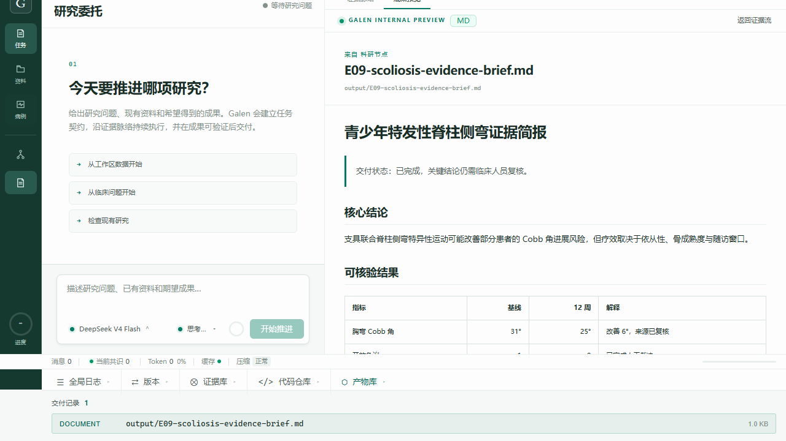

# Galen 发布前长尾与成果预览验证

日期：2026-08-29
基线提交：`fe84b37587410770e070a5184785b75456c9c5df`

## 结论

本轮对 E07（长上下文后保持指令并交付）和 E09（模糊请求转化为可预览交付）分别使用 DeepSeek V4 Flash / Pro 串行重复 20 次，共 80 次。全部通过硬门槛，80/80 个要求的 Artifact 均有效且可预览，工具错误为 0。

Galen 内部预览的浏览器闭环也已通过：从全局产物库打开 Markdown 后，界面会自动返回研究任务的成果画布，并渲染标题、引用、列表和 GFM 表格，而不是显示 Markdown 源码。Playwright 控制台为 0 error / 0 warning。

当前可以否定“框架稳定造成 150 秒无响应”，但不能声称已消灭模型长尾：80 次中捕获到 3 次约 23 秒首响应尖峰。尖峰同时出现在 Flash 和 Pro，更符合上游模型或网络偶发停顿；Galen 仍需要用本地即时任务回执、超时提示和可取消/降级策略保护用户体验。

## K=20 结果

百分位使用 nearest-rank 计算，单位为毫秒。

| 用例 | 模型 | 通过 | TTFR P50 | TTFR P95 | TTFR P99 / Max | Total P50 | Total P95 | Total P99 / Max |
| --- | --- | ---: | ---: | ---: | ---: | ---: | ---: | ---: |
| E07 | Flash | 20/20 | 711 | 22,318 | 22,942 | 12,620 | 32,947 | 35,125 |
| E07 | Pro | 20/20 | 1,217 | 2,135 | 2,223 | 18,615 | 25,148 | 27,162 |
| E09 | Flash | 20/20 | 739 | 1,137 | 1,310 | 11,958 | 13,780 | 14,639 |
| E09 | Pro | 20/20 | 1,110 | 2,200 | 23,135 | 13,975 | 18,458 | 34,246 |

四组均为 20/20，通过率的双侧 95% Wilson 下界为 0.839。K=20 已明显优于此前 K=5 的 0.566 下界，但仍不足以证明 99% 生产可靠性；下一阶段应持续积累到每条关键旅程至少 K=100。

## Token 与工具行为

| 用例 | 模型 | Input mean / P95 | Output mean / P95 | 请求/次 | 工具调用 | 工具错误 | 可预览产物 |
| --- | --- | ---: | ---: | ---: | ---: | ---: | ---: |
| E07 | Flash | 5,937 / 6,348 | 1,198 / 1,609 | 2.0 | 20 | 0 | 20/20 |
| E07 | Pro | 5,747 / 5,968 | 1,017 / 1,337 | 2.0 | 20 | 0 | 20/20 |
| E09 | Flash | 5,637 / 5,855 | 1,221 / 1,500 | 2.0 | 20 | 0 | 20/20 |
| E09 | Pro | 5,172 / 5,369 | 728 / 904 | 2.0 | 20 | 0 | 20/20 |

每次任务均收敛为 2 次模型请求和 1 次 `write_file`，没有重复工具循环。Pro 的输出更短，但 E07 的完整交付中位数比 Flash 慢约 6 秒；默认使用 Flash 的产品决策仍然合理，Pro 应保留给明确需要复杂推理的任务。

## 成果预览闭环

自动化旅程验证了：

1. 全局产物库显示登记数量和工作区相对路径；
2. 从任意工作台视图点击 Artifact，会自动回到研究任务并打开成果预览；
3. Markdown 一级标题被渲染为 `h1`；
4. GFM 表格被渲染为两行结果，而不是源码文本；
5. 预览中保留 Artifact 路径与“工作区内预览”状态；
6. 浏览器控制台 0 error / 0 warning，并保留 Playwright trace。



## 发布判断与下一步

- **正确性：通过。** 80/80 硬门槛通过，0 工具错误，80/80 产物有效且可预览。
- **预览闭环：通过。** 文档无需跳出 Galen，且已经从源码查看升级为结构化 Markdown 渲染。
- **典型响应：通过。** 四组 TTFR P50 均为 0.7–1.3 秒，不再复现 150 秒稳定启动延迟。
- **长尾体验：有条件通过。** 偶发 23 秒无首 token 仍不可接受；发布前应增加不依赖模型的本地任务回执，并在 8–10 秒展示“模型仍在响应”的明确状态，在更长超时提供取消和切换 Flash。
- **下一轮测评：** 将真实用户旅程扩至 K=100，并单列 TTFR 超过 8 秒的事件率；目标不是只降均值，而是把“无反馈超过 8 秒”控制在 1% 以下。

## 复现

```powershell
# 四组模型长尾（从 rust 目录执行）
.\target\debug\eval.exe run --case E07 --model deepseek-v4-flash --repeat 20 --output ..\evals\runs\release-tail-e07-flash-k20.jsonl
.\target\debug\eval.exe run --case E07 --model deepseek-v4-pro --repeat 20 --output ..\evals\runs\release-tail-e07-pro-k20.jsonl
.\target\debug\eval.exe run --case E09 --model deepseek-v4-flash --repeat 20 --output ..\evals\runs\release-tail-e09-flash-k20.jsonl
.\target\debug\eval.exe run --case E09 --model deepseek-v4-pro --repeat 20 --output ..\evals\runs\release-tail-e09-pro-k20.jsonl

# UI 与成果预览（从仓库根目录执行）
powershell -ExecutionPolicy Bypass -File .\scripts\evals\run_galen_ui_e2e.ps1
```

原始模型输出保留在被 Git 忽略的 `evals/runs/` 中，避免提交敏感或大体积运行记录；本报告只提交聚合指标与可视证据。
